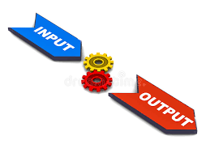
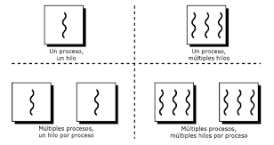
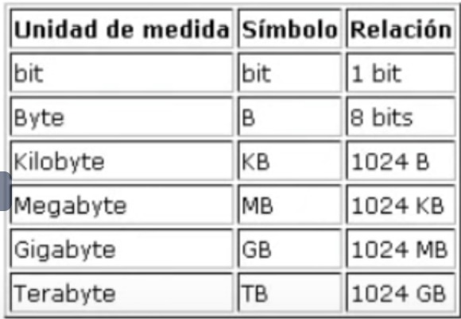
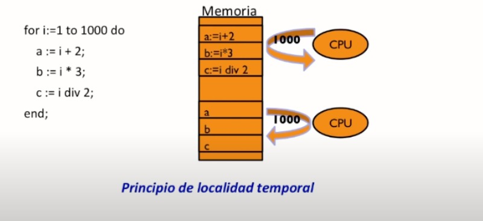
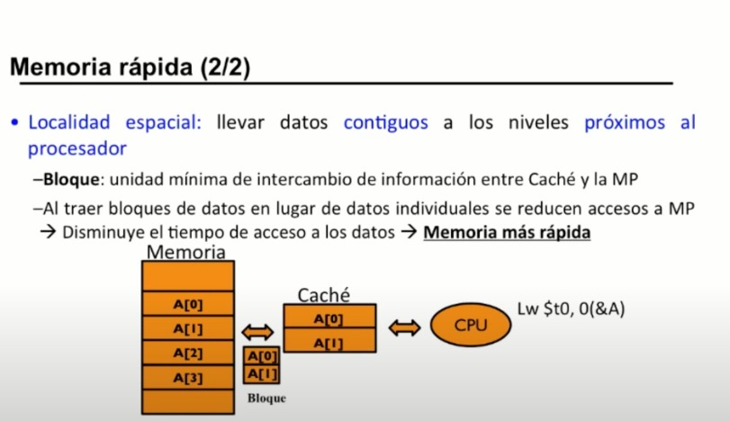

**Jimenez**

# Clase

# 1. ¿Qué hace un sistema operativo?
 Es un conjunto de programas que nos permite manejar la memoria, disco, medios de almacenamiento y los diferentes recursos del dispositivo. En pocas palabras el dispositivo no serviria de nada sin un sistema operativo.

 Una operacion E/S se puede definir como el conjunto de acciones necesarias para la transferencia de un conjunto de datos.

 

# 2. ¿Que es el Open Source?
Dicho termino se refiere a la libre edicion de algun programa o sistema, el cual puede ser midificado y compartido por cualquier persona, ya que su diseño es de acceso publico

# 3. Historia de los sistemas operativos Mac OS, Ubuntu y Windows

# 4. Comandos basicos de la terminal Unix (terminal de Mac o Ubuntu)
Los comandos basicos de Ubuntu son:

ps -aux: Nos muestra en tiempo real los procesos en ejecucucion.

sudo ps -U Ricardo: Muestra los procesos asignados al usuario Ricardo.

sudo pgrep VBoxClient: Se encarga de retornar el ID de los procesos
cuyo nombre coincida con la expresion regular.

sudo pgrep -l VBoxClient: Muestra el identificador del proceso y el
nombre.

top: top y htop listan los procesos en tiempo real con una serie de
atributos.

top -u Ricardo: los procesos del usuario Ricardo.

htop: para mostrar los procesos de manera horizontal.

kill pid: Termina o mata un proceso con un identificador que se le asigne.

renice 935 10: Cambia la prioridad de un proceso y los valores pueden variar de -20 a 19, Siendo 19 la prioridad mas baja.

# 5. Dispositivos de entrada/salida
Los dispositivos de entrada son aquellos dispositivos que introducen informacion en la computadora como un mouse, un teclado. Por otro lado los dispositivos de salida son los dispositivos a los que la computadora envia informacion, como lo seria por ejemplo una impresora.

Ademas de los dispositivos de entrada y salida tambien existen los dispositivos mixtos los cuales son aquellos que reciben y ademas introducen informacion en la computadora, un ejemplo seria una memoria USB, o una impresora inteligente.

Dispositivos de entrada:

Dispositivos de salida:

Dispositivos mixtos:

# 6. Procesos, ejemplo de algun algoritmo de planeacion
Dependiendo especialmente del sistema operativo en uso, a los procesos se les denomina como flujos de control, tareas, threads, o hilos, segun el contexto en el que se encuentren.

Al ser ejecutado mas de unproceso de forma concurrente en el sistema, todos estos necesitan que el mismo sitema les proporcione una serie de recursos. El sistema operativo gracias a la UCP (Unidad Central de Proceso), asigna estos recursos en el orden adecuado, atendiendo a todas y cada una de las propiedades. Ademas de esto el sistema tambien realiza funciones de sincronizacion de los procesos en ejecucion, para que se ejecuten en un orden adecuado y segun la prioridad asignada.

Hebra o Hilo (Threads)
Es un subproceso de un proceso el cual consume recursos propios, sin embargo depende del proceso padre que lo ah ejecutado. Estas representan un metodo software y eficacia de los sistemas operativos. las hebras de un mismo proceso comarten recursos, como memoria, archivos, recursos hardware, entre otros.

Un ejemplo de un proceso clasico seria al momento de usar Chrome, utilizando una pestaña de manera que unicamente se este utilizando una hebra. Al momento de abrir otra pestaña, Chrome no se volveria a cargar como proceso, sino que el programa ya convertido en proceso tendra dos hebras o hilos diferentes a su disposicion, por lo que el proceso sigue siendo el original.

### Transición de los procesos

Una vez que un programa se ah convertido en proceso, atraviesa varias fases o estados hasta ser finalizado.
Se le denominan transiciones a los cambios de estado en los que se puede encontrar un proceso.

**Transición A:** Se da cuando el programa en ejecucion necesita algun elemento, como señal o dato, para poder continuar con la ejecucion.

**Transición B:** Esta ocurre cuando el proceso ha utilizado el tiempo asignado por la UCP o procesador, para su ejecucion, y tiene que dejar paso al siguiente proceso.

**Transición C:** Ocurre cuando el proceso ya preparado pasa al proceso de ejecucion, lo que quiere decir que al proceso le llega una nueva disposicion de tiempo de la CPU para ser ejecutado.

**Transición D:** Es cuando el proceso pasa de estar bloqueeado a preparado. Es cuando el proceso recibe una orden que se estaba esperando para poder pasar al estado de preparado, y tras la transición, pasar a estado de ejecucion.

### Algoritmos de Planificación

- **Round robin.** Es un metodo para seleccionar todos los elementos de un grupo de manera equitativa, y en orden racional. Normalmente comienza por el primer elemeto de la lista hasta llegar al ultimo, y empezando nuevamente desde el principio. Este planteamiento es muy simple y facil de implementar, ademas de estar libre de inanicion.

- **Algoritmo FIFO (First In First Out) o FCFS (First Come First Serve).** Los procesos son asignados por el UCP en funcion de una cola FIFO. Es decir que se ejecuta el primer proceso en llegar de manera completa. A continuacion se ejecuta por completo el siguiente proceso que hay en la cola FIFo, siguiendo asi hasta terminar con el ultimo proceso. Este algoritmo se utiliza normalmente para la cuestion de trabajos en colas de impresion, respecto a los trabajos que van llegando a la impresora.

# 7. Almacenamiento
El almacenamiento es una pieza fundamental para el optimo funcionamiento de un dispositivo, ya que este nos proporciona mas capacidad en nuestro dispositivo, asi como una mayor velocidad. La memoria se divide en distintas unnidades, de las cuales las mas comunes son los Megabyte, Gigabyte, y Terabyte, pero ¿son toodas las que existen?

bit: Es la unidad minima representada por la letra b, la cual simplemente es un 0 o un 1.

Byte(B): Es la primera unidad de almacenamiento que tiene sentido como tal, esta esta compuesta por 8 bits (un Byte es aproximadamente un caracter).

Kilobyte(KB): Equivale a 1024 Bytes.

Megabyte(MB): 1024 KB.

Gigabyte(GB): 1024 MB.

Terabyte(TB): 1024 GB.

# 8. Jerarquia de Memoria
Una buena jerarquia de memoria nos ayuda a mantener nuestra computadora en optimas condiciones, debido a que tiene una organizacion definida, y nos ayuda a tener mas espacio libre para el uso y velocidad de nuestro dispositivo.

Los programadores quieren una memoria muy rapida, uy grande y de un coste razonable para su uso.

Muy rapida: Pequeña y cara.
Muy grande: Barata y lenta.
Coste razonable: Grande y lenta.

Por ejemplo una memoria SRAM con un tiempo de acceso tipico de 1 ns tiene un coste de 20 euros. Mientras que una SDRAM tiene un tiempo de acceso tipico de 5 ns tiene un coste de .01 euros. Un disco magnetico con un tiempo de acceso tipico de 8,500,000 ns tiene un coste de 0.0001 euros.

Una memoria SRAM es volatil, lo que quiere decir que los datos de esta se pierden una vez que el dispositivo es apagado o reiniciado (Se utiliza para implementar el cache).

Una memoria SDRAM se utiliza para implementar la memoria principal.

Localidad Temporal: dado que en algun momento la posicion de una memoria particular sea referenciada, es probable que la misma ubicacion vuelva a ser referenciada en un futuro.

# 9. Ejemplos de Virtualización del CPU, Virtualización de Memoria, Concurrencia, Persistencia