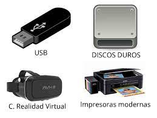

**Jimenez**

# Clase

# 1. ¿Qué hace un sistema operativo?
 Es un conjunto de programas que nos permite manejar la memoria, disco, medios de almacenamiento y los diferentes recursos del dispositivo. En pocas palabras el dispositivo no serviria de nada sin un sistema operativo

# 2. ¿Que es el Open Source?
Dicho termino se refiere a la libre edicion de algun programa o sistema, el cual puede ser midificado y compartido por cualquier persona, ya que su diseño es de acceso publico

# 3. Historia de los sistemas operativos Mac OS, Ubuntu y Windows

# 4. Comandos basicos de la terminal Unix (terminal de Mac o Ubuntu)
Los comandos basicos de Ubuntu son:
ejelee

# 5. Dispositivos de entrada/salida
Los dispositivos de entrada son aquellos dispositivos que introducen informacion en la computadora como un mouse, un teclado. Por otro lado los dispositivos de salida son los dispositivos a los que la computadora envia informacion, como lo seria por ejemplo una impresora.

Ademas de los dispositivos de entrada y salida tambien existen los dispositivos mixtos los cuales son aquellos que reciben y ademas introducen informacion en la computadora, un ejemplo seria una memoria USB, o una impresora inteligente.

Dispositivos de entrada:

Dispositivos de salida:

Dispositivos mixtos:

# 6. Procesos, ejemplo de algun algoritmo de planeacion

# 7. Almacenamiento

# 8. Jerarquia de Memoria
Una buena jerarquia de memoria nos ayuda a mantener nuestra computadora en optimas condiciones, debido a que tiene una organizacion definida, y nos ayuda a tener mas espacio libre para el uso y velocidad de nuestro dispositivo.

Los programadores quieren una memoria muy rapida, uy grande y de un coste razonable para su uso.

Muy rapida: Pequeña y cara.
Muy grande: Barata y lenta.
Coste razonable: Grande y lenta.

Por ejemplo una memoria SRAM con un tiempo de acceso tipico de 1 ns tiene un coste de 20 euros. Mientras que una SDRAM tiene un tiempo de acceso tipico de 5 ns tiene un coste de .01 euros. Un disco magnetico con un tiempo de acceso tipico de 8,500,000 ns tiene un coste de 0.0001 euros.

Una memoria SRAM es volatil, lo que quiere decir que los datos de esta se pierden una vez que el dispositivo es apagado o reiniciado (Se utiliza para implementar el cache).

Una memoria SDRAM se utiliza para implementar la memoria principal.

Localidad Temporal: dado que en algun momento la posicion de una memoria particular sea referenciada, es probable que la misma ubicacion vuelva a ser referenciada en un futuro.

# 9. Ejemplos de Virtualización del CPU, Virtualización de Memoria, Concurrencia, Persistencia